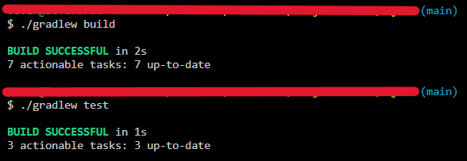
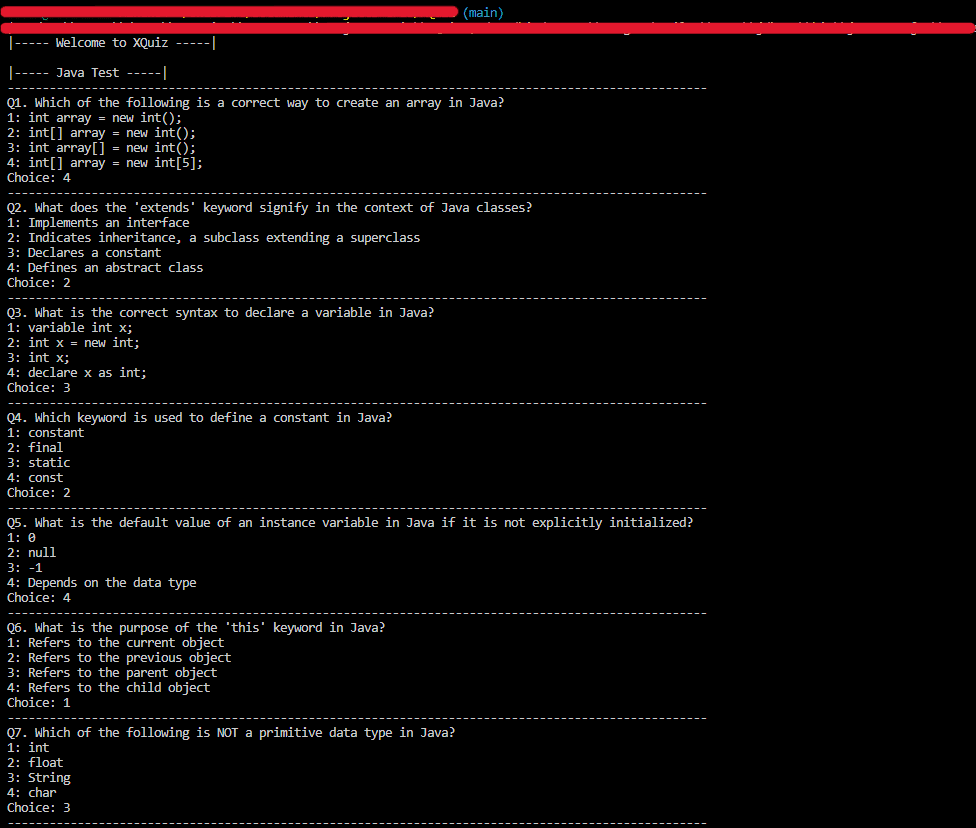
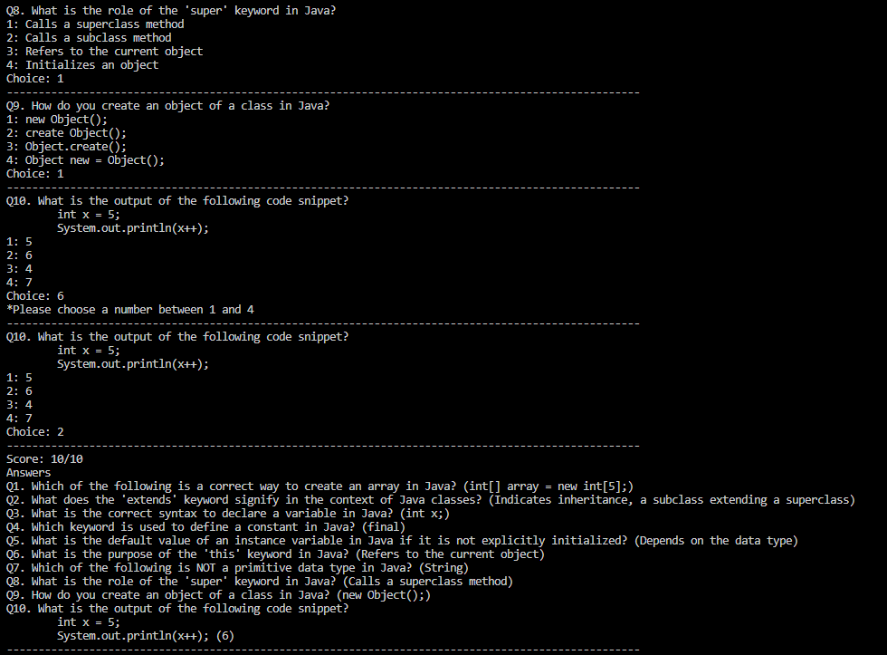

# XQuiz
`Java` `OOPs` `Unit Testing`

---

XQuiz is a quiz application that allows us to create a Quiz comprising multiple Questions. Each Question will have multiple choices, of which one will be a correct answer. This application can display the created Quiz to a user, get their choices for the Quiz, evaluate them, and provide a score.

---

During the course of this Micro-Experience, the developer:
* Comprehended the requirements of the application.
* Built the command line quiz application by following the OOPs concepts.
* Performed unit tests for checking the correctness of working of the application.

---

# Overview
XQuiz is a quiz application that allows us to create a Quiz comprising multiple Questions. Each Question will have multiple choices, of which one will be a correct answer. This application can display the created Quiz to a user, get their choices for the Quiz, evaluate them, and provide a score.

During the course of this Micro-Experience, the developer:
* Comprehended the requirements of the application.
* Built the command line quiz application by following the OOPs concepts.
* Performed unit tests for checking the correctness of working of the application.

# Build XQuiz using OOPs
## Scope of work
* Created Java classes using the concept of OOPs.
* Implemented a feature to display the quiz containing questions.
* Implemented a feature to allow users to attempt the quiz.
* Performed unit tests to check the correctness of the working of the application.

## Skills used
`Java` `OOPs` `Unit Testing`

---

# Screenshots

